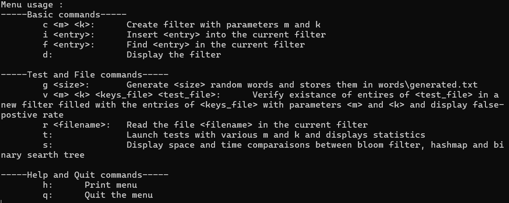
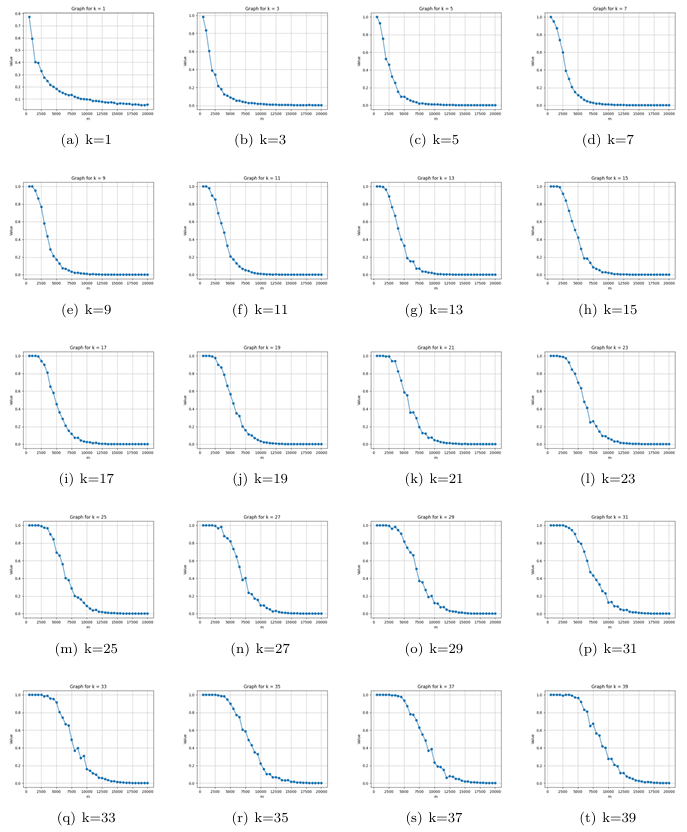
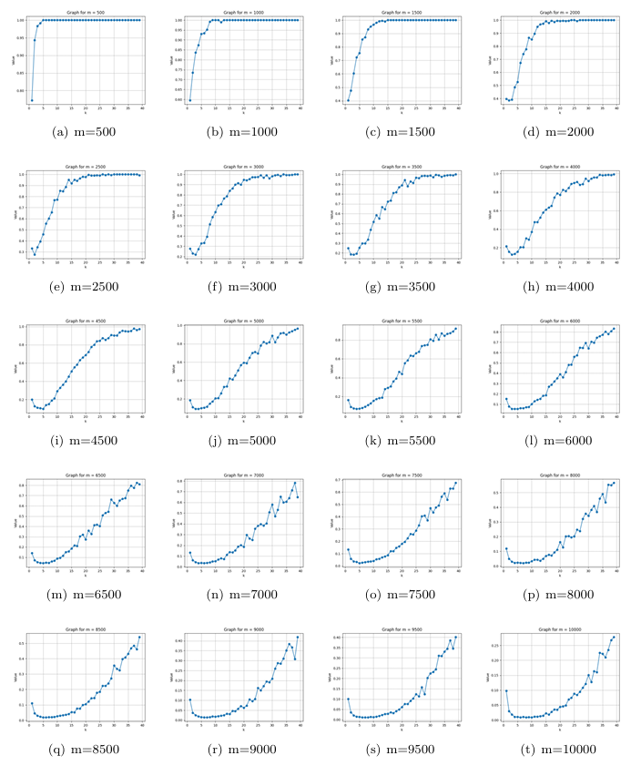
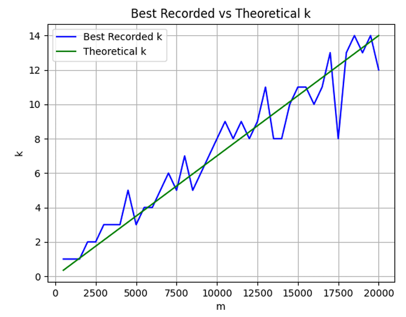
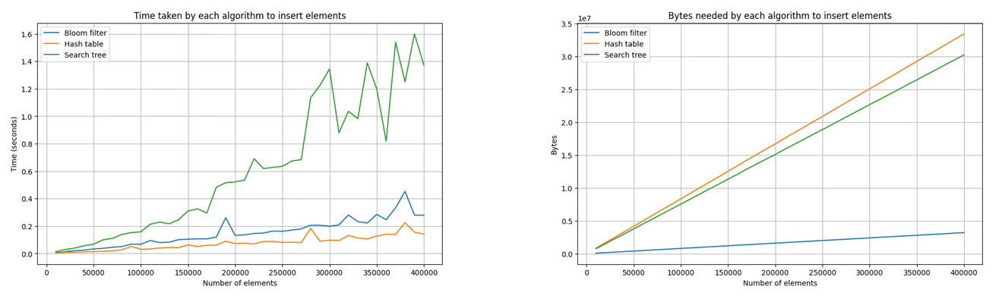

# Bloom Filter Implementation in C

This repository contains an implementation of a Bloom Filter data structure written in C. It provides functionalities to create filters, add entries, and test for set membership with a focus on analyzing space and time efficiency. The project also includes comparative tests against Hashmaps and Binary Search Trees.

## Project Structure

- `bin/`: Contains the compiled executable binary.
- `data/`: Contains input data files (e.g., word banks and generated words) used for testing the filter.
- `doc/`: Contains project documentation, including the final report.
- `include/`: Contains C header files (`.h`).
- `obj/`: Contains compiled object files (`.o`).
- `src/`: Contains C source files (`.c`).
- `stats/`: Stores generated statistical data from false positive tests.

## Build Instructions

This project uses `make` for compilation. A GCC compiler is required.

To build the project, run the following command from the root directory:

```sh
make
```

This will compile the source code and place the executable `bloom_filter` inside the `bin/` directory.

To clean the compiled object files and the binary, run:

```sh
make clean
```

## Running the Application

After a successful build, you can run the interactive menu using:

```sh
./bin/bloom_filter
```

Once the application is running, it will present a menu with several basic commands to interact with the Bloom Filter (e.g., create a filter, insert an entry, read from a file, run statistical tests).

<div align="center">
  
</div>

## Experimental Results & Analysis

This project not only implements a Bloom Filter but also empirically validates its theoretical properties. We conducted several experiments to analyze the false-positive rate behavior under various configurations and benchmarked its performance against Hash Tables and Binary Search Trees (BST). 

The results demonstrate that the theoretical characteristics of Bloom Filters hold remarkably true in practical application.

### 1. Impact of Filter Size (m) on False Positives
With a fixed number of hash functions ($k$), increasing the size of the bit array ($m$) drastically reduces the false positive rate. The empirical data confirms that a larger filter accommodates more elements before saturation, maintaining high query accuracy.

<div align="center">
  
</div>

### 2. Impact of Hash Functions (k) on False Positives
Conversely, when the filter size ($m$) is fixed, aggressively increasing the number of hash functions ($k$) will eventually degrade performance. Each additional hash function sets more bits per insertion, causing the filter to fill up rapidly and consequently increasing the false positive rate.

<div align="center">
  
</div>

### 3. Theoretical vs. Practical Optimal k
According to Bloom Filter theory, the optimal number of hash functions to minimize false positives for a given $m$ and number of inserted elements $n$ is calculated as $k \approx \frac{m}{n} \ln(2)$. Our empirical results closely trace this theoretical projection, proving the real-world reliability of the mathematical model.
<div align="center">
  
</div>

### 4. Space and Time Complexity Benchmarks
To validate its efficiency, the Bloom Filter was benchmarked against a Hash Table and a Binary Search Tree across up to 400,000 insertions.

- **Time Complexity**: The insertion and lookup times of the Bloom Filter approach those of a highly optimized Hash Table, proving it to be exceptionally fast (constant $O(k)$ time complexity).
- **Space Complexity**: As demonstrated below, the Bloom Filter requires a mere fraction of the memory consumed by both the Hash Table and the BST. 

<div align="center">
  
</div>

These findings confirm that the Bloom Filter is an exceptionally powerful data structure for scenarios demanding high-speed membership queries with stringent memory constraints.

For the complete, in-depth analysis (in French), please refer to the [project report](doc/rapport.pdf).
